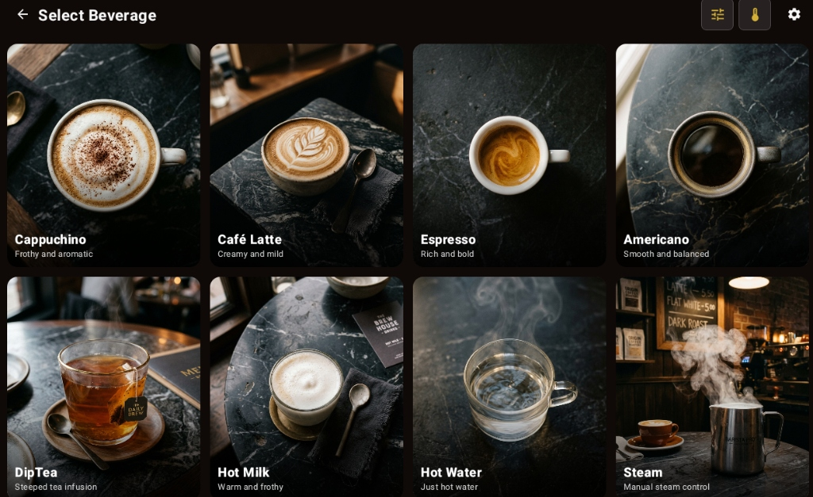
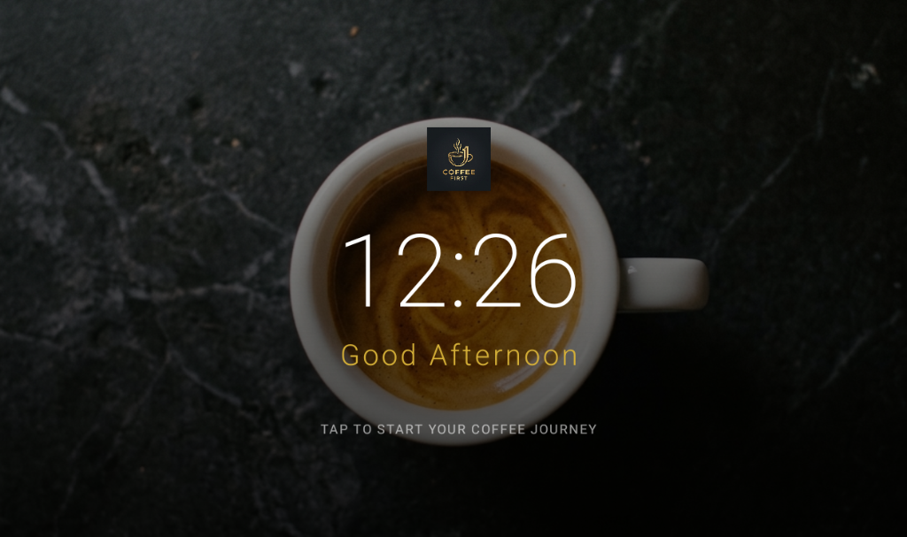

# ☕ CoffeeFirst: Custom Coffee Machine HMI

[](https://kotlinlang.org/)
[](https://developer.android.com/jetpack/compose)
[](https://www.quectel.com/)
[](LICENSE)

An elegant, high-fidelity Human-Machine Interface (HMI) Android application designed for capacitive touch display panels (1280x800 resolution) in landscape mode, running on the **Quectel SC200EE** platform (Android 12/13/14). Built entirely using **Jetpack Compose**, this project showcases a modern, minimalist dark espresso design with custom animations, interactive parameters, and robust state machine management.

---

## 🎨 Interactive User Interface

Here is a preview of the actual HMI display screens:

### 🖥️ Beverage Selection Dashboard

*The main coffee selection interface featuring realistic grid cards (Cappuccino, Café Latte, Espresso, Americano, DipTea, Hot Milk, Hot Water, Steam) with custom parameters, water temperature, and system configurations.*

### ⏳ Idle Attract Loop Screen

*The HMI sleep/screensaver view displaying a real-time digital clock, ambient greeting, and a minimal tap-to-start action.*

---

## ⚙️ Target Specifications & Display

* **Target Hardware:** Quectel SC200EE Smart Module (Qualcomm QCM2290 SoC, Adreno 702 GPU)
* **Screen Resolution:** 1280 × 800 (Landscape Mode)
* **Touch Panel:** Capacitive Multi-touch
* **Design Theme:** Dark Espresso (`#3E2723`) with Caramel Accent (`#FF8F00`) and Golden Highlights
* **Kiosk Configuration:** Immersive Fullscreen Mode (System Navigation & Status Bars hidden)

---

## 🚀 Key Features

* **Beverage Catalog:** Options for Espresso, Americano, Latte, Cappuccino, Macchiato, Hot Water, and Steam.
* **Customization Interface:** Adjust beverage volume, coffee strength, milk froth levels, and temperature through interactive slider components.
* **Mock State Machine:** Models realistic hardware steps like `Heating`, `Grinding`, `Brewing`, and `Dispensing` with clean transition timers.
* **Advanced Diagnostics:**
  * **Motor Settings & Movement Screen:** Control and test physical grinder, pump, and brewer motor parameters. Includes simulated RPM and current draw monitors.
  * **Factory & Maintenance Settings:** Calibrate sensors, clean coffee outlets, view error logs, and manage technical parameters behind a PIN security check.
* **Auto-Attract Loop:** Idle detection automatically triggers an elegant rotating screensaver/attract loop after periods of inactivity.

---

## 🛠️ Build & Installation

### Prerequisites
* **Android Studio Koala / Ladybug** or newer
* **Android SDK 31+** (Android 12+)
* **Gradle 8.0+**

### Local Setup & Compilation

1. **Clone the Repository:**
   ```bash
   git clone https://github.com/NightFury09/CoffeeFirst.git
   cd CoffeeFirst
   ```

2. **Build the Application via Gradle Wrapper:**
   * **Windows:**
     ```cmd
     gradlew.bat assembleDebug
     ```
   * **macOS / Linux:**
     ```bash
     ./gradlew assembleDebug
     ```

3. **Install the APK via ADB:**
   Connect your Quectel EVB or Android device and run:
   ```bash
   adb install -r app/build/outputs/apk/debug/app-debug.apk
   ```

---

## 🏗️ Architecture & Navigation

This application implements a **Single-Activity Architecture** utilizing Jetpack Compose's Navigation component:

* **[MainActivity](file:///c:/AJ/qt_app/qt_app/app/src/main/kotlin/com/coffeehmi/app/MainActivity.kt):** Sets full-screen kiosk attributes (forces landscape, hides system status and navigation bars) and initializes the theme context.
* **[NavGraph](file:///c:/AJ/qt_app/qt_app/app/src/main/kotlin/com/coffeehmi/app/ui/NavGraph.kt):** Governs transitions across all UI states:
  ```
  [Splash] ──→ [Idle Attract Loop] ──→ [Main Selection] 
                                              │
                      ┌───────────────────────┼───────────────────────┐
                      ↓                       ↓                       ↓
                [Customization]        [Settings Screen]      [Maintenance & Tech]
                      │                       │                       │
              [Brewing Flow]          [Factory Settings]      [Motor Diagnostics]
                      │
              [Completion Timer] ──→ (Timeout) ──→ [Back to Idle]
  ```

---

## 📜 License

This project is licensed under the MIT License - see the [LICENSE](LICENSE) file for details.
